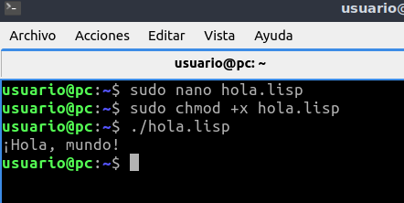

# Índice

#### [Introducción](#introduccion)
#### [Herramientas de desarrollo](#herramientas)
#### [Entornos integrados de desarrollo](#IDE)

<pre>
</pre>

<pre>
</pre>

# [Introducción](#indice) 
 

1. ¿Para que sirve un compilador? ¿Qué tipo de archivo obtenemos tras compilar?

        Un compilador es un programa que cambia el código que es entendible por los humanos por un código más rápido de entender por las máquinas.
El tipo de archivo que obtenemos depende del lenguaje con el que estemos programando, por ejemplo si estamos usando java y lo compilamos, obtendremos un .class.

 

2. ¿Para que sirve un enlazador? ¿Qué tipo de archivo obtenemos tras enlazar?

        Un enlazador es otro programa que une varios pedazos de código en uno solo, estos pedazos de código surgen de lo que queda tras compilar el código origen.
Tras enlazar varios pedazos de código obtenemos un fichero ejecutable.

 

3. ¿Para que sirve un interprete? ¿Obtenemos algún archivo tras interpretar?

        Un intérprete sirve para convertir y ejecutar código, que a diferencia de un compilador el intérprete ejecuta el código directamente.
El intérprete sólo interpreta el código o traduce, pero no nos crea ningún archivo.

 

4. Explica cada uno de los siguientes conceptos e indica la relación entre ellos.
 
- Código fuente: Código del programa legible escrito en un lenguaje de programación.

- Código objeto: Código que se obtiene al compilar el código fuente, no se puede leer ni modificar por las personas.

- Código binario: Código que utiliza la computadora para entender y ejecutar el programa, solo se usan dos dígitos: 0 y 1.

 

5. ¿Qué tipo de código es el `bytecode` generado por el compilador de Java?
 

<pre>
    
    El bytecode es un código que no depende de ningún idioma ni de ningún país, sino que es universal, que para descifrarlo se usa la máquina virtual de java, que interpreta el bytecode y lo ejecuta en su sistema.

</pre>

 

# [Herramientas de desarrollo](#indice) 

1. Ejecuta el programa "Hola mundo" en los siguientes lenguajes:
 

 - bash:
    
Script: 

    #!/usr/bin/env bash 
    echo "Hola mundo"

 - python:
  
Script: 

    #!/usr/bin/env python3 
    print ("Hola mundo")

 - php:
    
Script: 

    #!/usr/bin/env php

    <?php 
    echo "Hola mundo\n" 
    ?>

 - javascript (nodejs)
    
Script: 

    #!/usr/bin/env node

    console.log('Hola mundo');

 - c
    
Script: 

    #include <stdio.h>

    int main() {
        printf("¡Hola mundo!");
        return 0;
    }

* No entiendo porque no funciona
  

 - c++
    
Script: 

    #include <iostream>

    using namespace std;

    int main()
    {
    cout << "¡Hola, mundo!" << endl;
    return 0;
    }

 - java
    
Script: 

    class Hola
    {
        public static void main(String[] args)
        {
            System.out.println("Hola Mundo");
        }
    }

 - ruby
    
Script: 

    #!/usr/bin/env ruby

    puts "Hola Mundo"

 - go 
  
Script:

        package main

        import "fmt"

        func main() {
                fmt.Println("Hola mundo desde Go")
        }

 - rust

Script: 

        fn main() {
            println!("¡Hola, mundo! Desde RUST ");
        }

 - lisp
 
Script: 

    #!/usr/bin/env clisp

    (format t "¡Hola, mundo!")

 - ensamblador (nasm)
  
Script: 

    section .data
    
    msg     db "¡Hola Mundo!", 0Ah
    len     equ     $ - msg  
    
    section .text
    
    global _start
    
    _start:
            mov     eax, 04h
            mov     ebx, 01h
            mov     ecx, msg
            mov     edx, len
            int     80h
            mov     eax, 01h
            mov     ebx, 00h
            int     80h

- No se porque no va 

  
2. Para cada uno de los lenguajes anteriores, indica el proceso realizado para conseguir ejecutar el código: ¿compilación o interpretación?
   
- Bash: Es un lenguaje interpretado12.
- Python: Es tanto un lenguaje compilado como interpretado
- PHP: Es un lenguaje interpretado
- JavaScript (Node.js): Es un lenguaje interpretado
- C: Es un lenguaje compilado
- C++: Es un lenguaje compilado
- Java: Es tanto un lenguaje compilado como interpretado
- Ruby: Es tanto un lenguaje compilado como interpretado
- Go: Es un lenguaje compilado
- Rust: Es un lenguaje compilado
- Ensamblador (NASM): Es un lenguaje compilado.
  

 

3. Para cada uno de los lenguajes anteriores, indica el nombre del compilador o interprete utilizado en GNU/Linux.

- C: GCC (GNU Compiler Collection)12
- C++: GCC (GNU Compiler Collection)12
- Java: OpenJDK3
- Ada: GNAT (GNU NYU Ada Translator)4
- Objective-C: GCC (GNU Compiler Collection)15
- Objective-C++: GCC (GNU Compiler Collection)15
- Fortran: GFortran67

 

4. Investiga y averigua que extensión tienen los archivos de código fuente de los siguientes lenguajes:

  - bash: .sh
  - python: .py
  - php: .php
  - javascript: .js
  - c: .c
  - c++: .cc o .C
  - java: .java
  - ensamblador: .s
  - ruby: .rb, .rjs
  - go: .go
  - rust: .rs
  - lisp: .lisp, .cl, .ss o .rkt
  

 

5. Scripts ejecutables para los lenguajes interpretados. Edita los scripts para los siguientes lenguajes:

  - bash:

        #!/bin/bash
        
        echo "¡Hola, mundo!"

  - python

        print("¡Hola, mundo!")

  - php

        <?php
        echo "¡Hola, mundo!";
        ?>
 
  - javascript

        console.log("¡Hola, mundo!");

  - java

        public class HolaMundo {
            public static void main(String[] args) {
                System.out.println("¡Hola, mundo!");
            }
        }

  - ruby

        puts "¡Hola, mundo!"
 
  - go

        package main

        import "fmt"

        func main() {
            fmt.Println("¡Hola, mundo!")
        }

  - rust

        fn main() {
            println!("¡Hola, mundo!");
        }

  - lisp

        (print "¡Hola, mundo!")

  Instrucciones en https://github.com/jamj2000/HolaMundo.

 

1. ¿Qué extensión tienen los archivos de código objeto?

- Windows:

.obj

Ejemplo: archivo.obj

- Unix/Linux:

.o

Ejemplo: archivo.o

- Mac OS:

.o

Ejemplo: archivo.o

 

7.   Bibliotecas. Define que se entiende por biblioteca o librería y los tipos que existen.

    Una biblioteca es un conjunto de funciones, clases y métodos que se pueden utilizar para desarrollar software. Las bibliotecas se utilizan para reutilizar el código existente y para ahorrar tiempo

Existen diferentes tipos de bibliotecas y librerías, cada una con objetivos y usuarios específicos. 

 
12.   Bibliotecas. ¿Qué tipo es el más utilizado actualmente? ¿Por qué?

    En programación, no hay un tipo de biblioteca o librería que sea el más utilizado actualmente. El uso de bibliotecas y librerías depende del lenguaje de programación

14.  Bibliotecas. Crea una biblioteca dinámica en Java que proporcione las funciones para sumar, restar, multiplicar y dividir 2 números enteros.
Crea un programa que haga uso de ella y comprueba que se ejecuta correctamente.

  Instrucciones en https://github.com/jamj2000/Bibliotecas

Aqui la biblioteca:

public class Biblioteca {
    public static int add(int a, int b) {
        return a + b;
    }

    public static int subtract(int a, int b) {
        return a - b;
    }

    public static int multiply(int a, int b) {
        return a * b;
    }

    public static int divide(int a, int b) {
        if (b == 0) {
            throw new IllegalArgumentException("Cannot divide by zero!");
        }
        return a / b;
    }
}

Aqui el main:

public class Main {
    public static void main(String[] args) {
        int a = 10;
        int b = 5;

        System.out.println("a + b = " + MathLibrary.add(a, b));
        System.out.println("a - b = " + MathLibrary.subtract(a, b));
        System.out.println("a * b = " + MathLibrary.multiply(a, b));
        System.out.println("a / b = " + MathLibrary.divide(a, b));
    }
}

15. Bibliotecas. Busca información y explica las ventajas y desventajas de usar bibliotecas estáticas.

- Ventajas:

Las bibliotecas estáticas resisten la vulnerabilidad porque viven dentro del archivo ejecutable.
La velocidad en tiempo de ejecución se produce más rápido porque su código objeto (binario) está en el archivo ejecutable.

- Desventajas:

Los cambios realizados en los archivos y el programa requieren volver a enlazar y recompilar.
El tamaño del archivo es mucho mayor.

16.  Bibliotecas. Busca información y explica las ventajas y desventajas de usar bibliotecas dinámicas.

- Ventajas:

Solo necesita una copia en tiempo de ejecución.
Varias aplicaciones en ejecución utilizan la misma biblioteca sin necesidad de que cada archivo tenga su propia copia.
Contienen archivos más pequeños.
Las bibliotecas dinámicas están vinculadas en tiempo de ejecución.

- Desventajas:

¿Qué pasa si la biblioteca dinámica se daña?

18.   Build. Automatiza el proceso de compilación de ejecutable y biblioteca, su enlazado y la generación del archivo .jar para código fuente en Java con Ant. Haz uso de un buildfile.    

  Instrucciones en https://github.com/jamj2000/Bibliotecas/blob/master/Build.md 

19. Build. Automatiza el proceso de compilación de ejecutable y biblioteca, su enlazado y la generación del archivo .jar para código fuente en Java con Maven. Haz uso de un buildfile.

- copilar

- exec

- ejecucion codigo

- test

  Instrucciones en https://github.com/jamj2000/Bibliotecas/blob/master/

